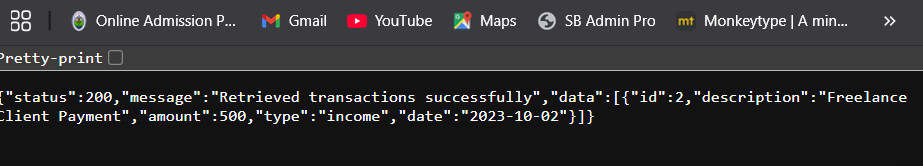

1. Markdown
2. # RESTful API Activity - [Hazel P. Sadiwa]
3. ## Best Practices Implementation
4. **1. Environment Variables:**
5. - Why did we put `BASE_URI` in `.env` instead of hardcoding it?
6. - Answer: We put BASE_URI in .env instead of hardcoding so that it can be changed per environment without modifying the code.
7. **2. Resource Modeling:**
8. - Why did we use plural nouns (e.g., `/dishes`) for our routes?
9. - Answer: We use plural nouns for our routes to represent our resources to keep our API consistent.
10. **3. Status Codes:**
11. - When do we use `201 Created` vs `200 OK`?
12. - Why is it important to return `404` instead of just an empty array or a generic error?
13. - Answer: We use 201 created when a new we successfully created a resource, on the other hand we 200 OK when a request succeeds without creating a new resource. While 404 is important to return because it tells the client that the requested resource doesn't exist.
14.
15. **4. Testing:**
16. -  